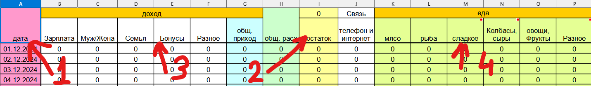

# Home finance analysis

It is try to create some graphs from file with incomes/expenses.  
Just write down your incomes/expenses in excel sheets. Use ./data/template.xlsx

## template.xlsx structure

Sheet names consists of `{Month}_{year}` for example: **January_2024**

1. Data header. **SHOULD NOT** be changed.
2. Savings header. **SHOULD NOT** be changed.
3. Incomes header. Could be changed (Names and count of the columns).
4. Expenses header. Could be changed (Names and count of the columns).
   Headers for columns **always** should have **2-levels**.
